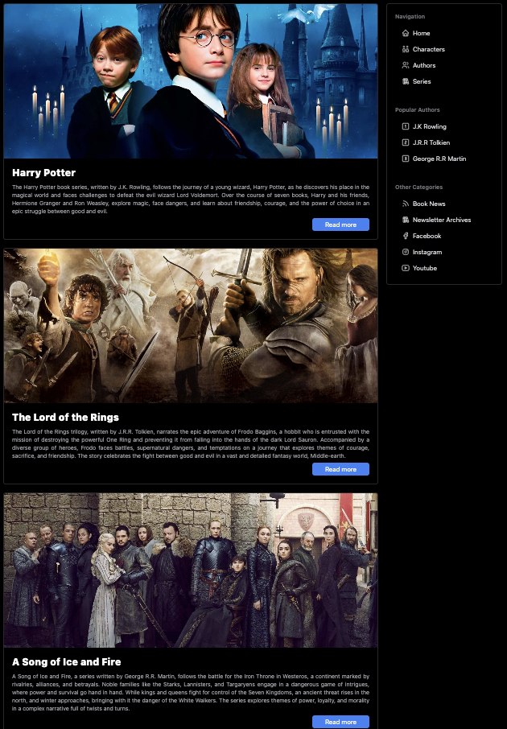

# Order of Books

Welcome to the _Order of Books_ project! A website developed during the Dev training event by Cod3r, where you can explore the most iconic book series and discover the correct reading order, along with affiliate links to make it easier to purchase the books on Amazon.

## Project Screenshot

## Index

- [Objective](#objective)
- [Project Description](#project-description)
- [Technologies Used](#technologies-used)
- [Features](#features)
- [Future Features](#future-features)
- [Contributions](#contributions)
- [Contact](#contact)
- [Notes](#notes)

### 🎯 Objective

The goal of this project is to make it easier to organize and visualize the reading order of major book series, such as Harry Potter, The Lord of the Rings, and A Song of Ice and Fire. Additionally, it provides affiliate links for those who wish to purchase the books directly from Amazon.

### 📖 Project Description

_Order of Books_ is an interactive and responsive website that displays book series organized by chronological reading order. Each book includes information and purchase links on Amazon, providing a practical and intuitive experience.

The site also features an author section, currently listing authors from the Harry Potter series, and other planned sections such as characters, latest news, and communication channels (Facebook, Instagram, and YouTube).

### 🛠️ Technologies Used

- **HTML5**: For content structure.
- **JavaScript**: For application logic.
- **Node.js**: For a simple backend.
- **JSON**: For data storage and organization of books.
- **TailwindCSS**: For efficient and responsive styling.
- **Svelte**: Framework for building the user interface.
- **Vite**: For a fast and efficient build process with ES module support.

### ⚙️ Features

- Display of the reading order of the Harry Potter, The Lord of the Rings, and A Song of Ice and Fire series.
- Affiliate links for purchasing books on Amazon.
- Author section with information about the series' writers.
- Intuitive interface and responsive design.
- Data stored in JSON format for easier updates and maintenance.

### 🌟 Future Features

- Add new popular book series.
- Include book reviews and ratings.
- Expand the author section.
- Complete the character, latest news, and communication channels sections.
- Possibility to reuse the code to organize other types of collections, such as movies or games.

### 🤝 Contributions

Contributions are welcome! To contribute:

- **Open an Issue**: Report a bug or suggest an improvement.
- **Create a Pull Request**: Make changes to the code and submit a request for review.

### 📧 Contact

For questions or feedback, reach out:

- Email: amalsalehfernandes@gmail.com

### **Notes**

This project was created for educational purposes and to showcase technical skills. The affiliate links are optional and are intended to support the developer.

Made with 💖 by Amal
